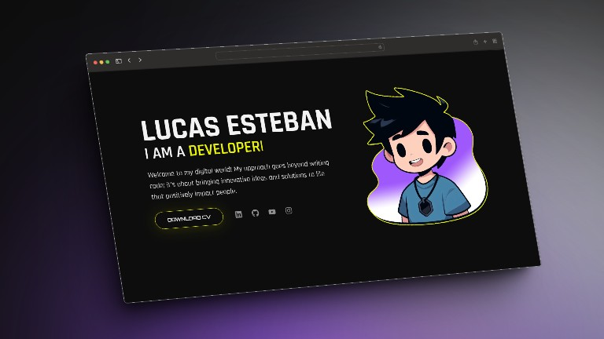

# Front-End Portfolio

This is my front-end portfolio, showcasing some of my projects and web development skills.

## Contents

- [Front-End Portfolio](#front-end-portfolio)
  - [Contents](#contents)
  - [Technologies Used](#technologies-used)
  - [Screenshots](#screenshots)
  - [Usage Instructions](#usage-instructions)

## Technologies Used

- HTML5
- CSS3
- JavaScript
- React.js
- Vite
- Framer-Motion
- Type-animation
- React-scroll
- React-icons
- React-router-dom

## Screenshots

## Usage Instructions

1. Clone this repository to your local machine:
// git clone "https://github.com/lucasestebanlps/lucasestebanlps.github.io.git"

2. Feel free to modify!