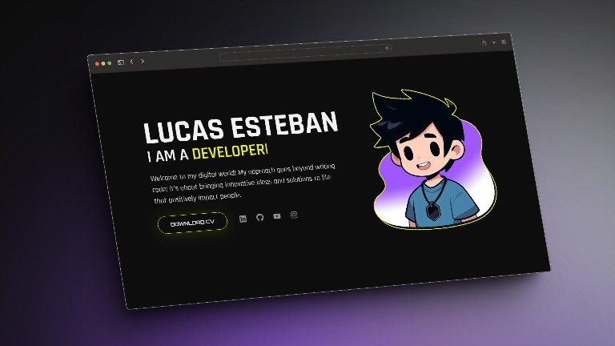

# Front-End Portfolio

This is my front-end portfolio, showcasing some of my projects and web development skills.

## Contents

- [Front-End Portfolio](#front-end-portfolio)
  - [Contents](#contents)
  - [Technologies Used](#technologies-used)
  - [Screenshots](#screenshots)
  - [Usage Instructions](#usage-instructions)

## Technologies Used

- HTML5
- CSS3
- JavaScript
- React.js
- Vite
- Framer-Motion
- Type-animation
- React-scroll
- React-icons
- React-router-dom

## Screenshots



## Managing projects (CMS)

Projects are managed with a web panel (Decap CMS). To add, edit or reorder
projects without touching code, see **[docs/CMS.md](./docs/CMS.md)**.

Quick start (local editing):

```bash
npx decap-server   # terminal 1
npm run dev        # terminal 2
# open http://localhost:5173/admin/
```

## Link:
https://lucasestebanlps.github.io
